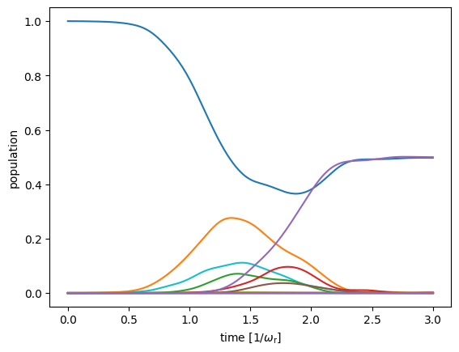
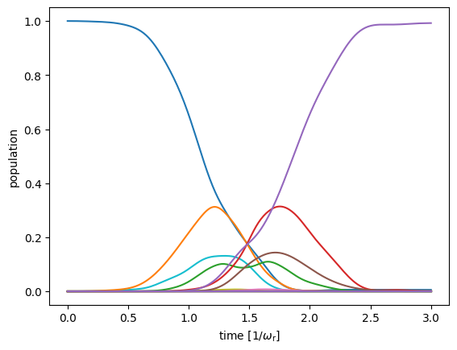
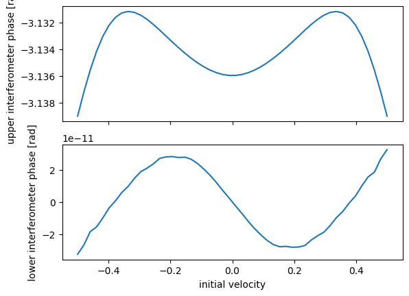

Quickstart
##########

:code:`mwave` is a python library designed to help explore new matterwave interferometer geometries. :code:`mwave` also provides functions to numerically solve the Bloch Hamiltonian that describes Bragg diffraction and Bloch oscillations.

Installation
============

Stable releases of :code:`mwave` can be downloaded from `Github`_.

.. _Github: https://github.com/jc-roth/mwave/releases

The latest version of :code:`mwave` can be installed directly from Github via

.. code-block::

   pip install git+https://github.com/jc-roth/mwave.git

A first example
===============

Defining an interferometer geometry
-----------------------------------

:code:`mwave` is losely broken up into two parts: a module for symbolically defining arbitrary interferometer geometries, and a module for numerically calculating Bragg and Bloch processes. As an example we will use the library to explore a Mach-Zender interferometer geometry.

First we will import the required libraries

.. code:: ipython3

    from mwave import symbolic as msym
    from mwave import integrate as mint
    import numpy as np
    import sympy as sp
    from matplotlib import pyplot as plt

:code:`mwave` internally uses the :code:`sympy` library to build symbolic expressions of
the interferometer phase. Therefore we must define the symbols we want
to use symbolically

.. code:: ipython3

    m, c, hbar, k, g, delta, n, T, t_traj = sp.symbols('m c hbar k g delta n T t_traj', real=True)
    k_eff = 2*k

Performing certain operations in mwave requires the user to set certain
constants. In this example we will need to set the mass, speed of light,
the Planck constant, and another variable called :code:`t_traj`.

.. code:: ipython3

    msym.set_constants(m=m, c=c, hbar=hbar, t_traj=t_traj)

The unitary operators that we will use to build the interferometer
require these constants. If they are not provided an error will be
thrown. At first glance it makes sense that we need to define constants representing the mass, speed of
light, and the Planck constant in order to define our unitary operators. :code:`mwave` also provides the ability to compute the position of each interferometer path as a function of time, and :code:`t_traj` is used to parameterize this time.

Now we are ready to define unitary operators representing the beamsplitter,
free evolution, and mirror that make up the Mach-Zender interferometer:

.. code:: ipython3

    beamsplitter = msym.Beamsplitter(0, n, delta, k_eff, include_half_pi_shift=True)
    mirror = msym.Mirror(0, n, delta, k_eff)
    free = msym.FreeEv(T, gravity=g)

Now that we have defined our unitary operators we can define a new
interferometer object and apply our unitary operators to it.

.. code:: ipython3

    ifr = msym.Interferometer()
    ifr.apply(beamsplitter)
    ifr.apply(free)
    ifr.apply(beamsplitter)
    ifr.apply(free)
    ifr.apply(beamsplitter)

Thats it! We have defined the full Mach-Zender interferometer! Note that
unitary operators can also be applied using the matrix multiplication
operator, i.e. ``free @ (beamsplitter @ ifr)``.

Now lets compute the phase of the interferometer. To do this we must
first call the :py:meth:`mwave.symbolic.Interferometer.interfere` method to
check which interferometer paths interfere.

.. code:: ipython3

    interfering_paths = ifr.interfere()
    print(f'Found {len(interfering_paths)} interfering paths.')

.. parsed-literal::

    Found 2 interfering paths.

This is expected as a Mach-Zender interferometer has two output ports.

Now that we have computed the interfering paths we can compute the phase
difference between each interfering output:

.. code:: ipython3

    phase_differences = ifr.phases()
    for phase_difference in phase_differences:
        print(sp.simplify(phase_difference))

.. parsed-literal::

    2*T**2*g*k*n - pi
    2*T**2*g*k*n

See the `Interferometer Geometries`_ section for more in-depth examples of how to define and analyze interferometer geometries.

.. _`Interferometer Geometries`: examples/geometries.ipynb

Simulating Bragg beamsplitters
------------------------------

Next we can use the :py:meth:`mwave.integrate.gbragg` function to integrate some initial momentum state through a Bragg diffraction beamsplitter and mirror. We will just eyeball the effective Rabi frequencies for each

.. code:: ipython3

    n0, nf = 0, 4
    sigma = 0.5
    omega_bs = 16.1
    omega_mirror = 21
    kvec, n0_idx, nf_idx = mint.make_kvec(n0,nf)
    
    sol = mint.gbragg(kvec, mint.make_phi(kvec, n0), 6*sigma, 4*(n0+nf), omega_bs, sigma)
    mint.pops_vs_time(kvec, sol.t, sol.y.T)
    plt.show()
    
    sol = mint.gbragg(kvec, mint.make_phi(kvec, n0), 6*sigma, 4*(n0+nf), omega_mirror, sigma)
    mint.pops_vs_time(kvec, sol.t, sol.y.T)
    plt.show()

That seems to have worked well enough!

See the `Integrating the Bloch Hamiltonian`_ section for other examples of evolving wavefunctions under the Bloch Hamiltonian.

.. _`Integrating the Bloch Hamiltonian`: examples/bloch_ham_integration.ipynb

Combining the interferometer model with simulation
--------------------------------------------------

Lets say that we want to study the systematics introduced by the Bragg diffraction process in our Mach-Zender geometry. To do this we need to combine the numerical computation we've made using :py:meth:`mwave.integrate.gbragg` with our symbolic representation of the interferometer geometry. This is accomplished in a straightforward way by defining custom :py:class:`mwave.symbolic.Unitary` classes that inherit from the :py:class:`mwave.symbolic.Beamsplitter` and :py:class:`mwave.symbolic.Mirror` classes.

Our beamsplitters will couple momentum states :math:`0` and :math:`n`

.. code:: ipython3

    class BraggBeamsplitter(msym.Beamsplitter):
    
        def gen_numeric(self, node, subs={}):
            delta = msym.eval_sympy_var(self.delta, subs)
            kvec, _, _ = mint.make_kvec(msym.eval_sympy_var(self.n1, subs), msym.eval_sympy_var(self.n2, subs))
            n_idx = np.argmin(np.abs(2*msym.eval_sympy_var(node.n,subs) - kvec))
            n_parent = msym.eval_sympy_var(node.parent.n,subs)
            def fnc(v):
                sol = mint.gbragg(kvec, mint.make_phi(kvec, n_parent), 2*3*sigma, delta + 4*v, omega_bs, sigma)
                return sol.y[n_idx,-1]
            return fnc
    
    class BraggMirror(msym.Mirror):
    
        def gen_numeric(self, node, subs={}):
            delta = msym.eval_sympy_var(self.delta, subs)
            kvec, _, _ = mint.make_kvec(msym.eval_sympy_var(self._n1, subs), msym.eval_sympy_var(self._n2, subs))
            n_idx = np.argmin(np.abs(2*msym.eval_sympy_var(node.n,subs) - kvec))
            n_parent = msym.eval_sympy_var(node.parent.n,subs)
            def fnc(v):
                sol = mint.gbragg(kvec, mint.make_phi(kvec, n_parent), 2*3*sigma, delta + 4*v, omega_mirror, sigma)
                return sol.y[n_idx,-1]
            return fnc

Now we can define new unitary operators using these definitions and
apply them to an interferometer.

.. code:: ipython3

    bragg_beamsplitter = BraggBeamsplitter(0, n, delta, k_eff)
    bragg_mirror = BraggMirror(0, n, delta, k_eff)
    
    ifr_num = msym.Interferometer()
    ifr_num.apply(bragg_beamsplitter)
    ifr_num.apply(free)
    ifr_num.apply(bragg_mirror)
    ifr_num.apply(free)
    ifr_num.apply(bragg_beamsplitter)

Now we will make use of the :py:meth:`mwave.symbolic.Interferometer.get_ports`
function to automatically map the interferometer outputs into their
respective ports.

.. code:: ipython3

    ifr_num.interfere()
    port_dict, junk_port, no_port = ifr_num.get_ports({n: 'upper', 0: 'lower'})

Now we can take the :py:class:`mwave.symbolic.InterferometerNode` objects in
each port and generate functions that numerically calculate their
respective complex amplitudes. To generate these functions we must also
set our symbolic variables to numeric values.

.. code:: ipython3

    subs = {hbar:1, k:1, m: 1, g: 1, n: 4, delta: 4*n, T:5}
    
    u1 = port_dict['upper'][0].gen_numeric_wf_func(subs)
    u2 = port_dict['upper'][1].gen_numeric_wf_func(subs)
    
    l1 = port_dict['lower'][0].gen_numeric_wf_func(subs)
    l2 = port_dict['lower'][1].gen_numeric_wf_func(subs)
    
    # Create a function to compute the phase between the output wavefunctions
    def calc_phase(v):
        uphase, lphase = np.angle(u1(v)/u2(v)), np.angle(l1(v)/l2(v))
    
        return uphase, lphase

Note that these numerically calculated complex amplitudes do not include
any of the analytically derived phases.

Finally we can compute and plot how the populations vary as a function
of the input particle velocity

.. code:: ipython3

    vs = np.linspace(-0.5, 0.5, 50)
    upper = np.full_like(vs, np.nan)
    lower = np.full_like(vs, np.nan)
    
    for i in range(len(vs)):
        upper[i], lower[i] = calc_phase(vs[i])
    
    fig, [ax1, ax2] = plt.subplots(nrows=2, sharex=True)
    ax1.plot(vs, upper)
    ax2.plot(vs, lower)
    ax2.set_xlabel('initial velocity')
    ax1.set_ylabel('upper interferometer phase [rad]')
    ax2.set_ylabel('lower interferometer phase [rad]')
    plt.show()

The paths that interfere in the upper output port of the interferometer
do not experience the same set of beamsplitter/mirror pulses, and so
they experience a phase dependent on the input velocity. The paths that
interfere in the lower output port of the interferometer experience the
same set of beamsplitters, and mirrors that are equivalent via a frame
transformation. Therefore the imperfect phase imprinted by the Bragg
process cancels out in this output port.

See the :ref:`numercal_evaluation_sci` section for a more detailed example of how to implement the :py:meth:`mwave.symbolic.Unitary.gen_numeric` function.

Sometimes we might be interested in having more direct control over the phases
that contribute to this numerical calculation. To help with this :code:`mwave` provides the code generation function :py:meth:`mwave.symbolic.Interferometer.generate_code_outline`:

.. code:: ipython3

    port_dict, junk_port, no_port = ifr.get_ports({n: 'upper', 0: 'lower'})
    print(ifr.generate_code_outline(port_dict))

.. parsed-literal::

    def args_lookup(x, y, v):
        return (np.ones_like(x), )
    
    def bs(ni, nf, *args):
        if ni == nf:
            return (0.5+0j)*args[0]
        else:
            return (0+0.5j)*args[0]
    
    def calc_populations(x0, y0, v0, ncopies):
        
        # Compute the ones array
        ones = np.ones(ncopies)
    
        # Compute positions at each beamsplitter
        x1, y1 = x0 + vx*T, y0 + vy*T
        x2, y2 = x1 + vx*T, y1 + vy*T
        
        # Compute velocity at each beamsplitter
        v1 = v0
        v2 = v1
        
        # Compute arguments at each beamsplitter
        args0 = args_lookup(x0, y0, v0)
        args1 = args_lookup(x1, y1, v1)
        args2 = args_lookup(x2, y2, v2)
        
        # Compute wavefunctions
        portlower_1 = bs(0,0,*args0)*bs(0,n,*args1)*bs(n,0,*args2)
        portlower_2 = bs(0,n,*args0)*bs(n,0,*args1)*bs(0,0,*args2)
        
        portupper_1 = bs(0,0,*args0)*bs(0,n,*args1)*bs(n,n,*args2)
        portupper_2 = bs(0,n,*args0)*bs(n,0,*args1)*bs(0,n,*args2)
        
        # Interfere
        portlower = np.einsum('i,j->ij', portlower_1, ones) + np.einsum('i,j->ij', portlower_2, ones)
        portupper = np.einsum('i,j->ij', portupper_1, ones) + np.einsum('i,j->ij', portupper_2, ones)
        
        # Compute populations
        poplower = np.sum(np.abs(portlower)**2, axis=0)
        popupper = np.sum(np.abs(portupper)**2, axis=0)
        
        # Return
        return poplower, popupper

We can see that this outline computes the wavefunctions output by the interferometer. We can use this outline to start incorporating additional interferometer effects.

Planned improvements
====================

Several changes are planned for the future:

- Support installation from Pypi
- Better code generation
- Adding a variable in :py:class:`mwave.symbolic.InterferometerNode` to track the internal state.