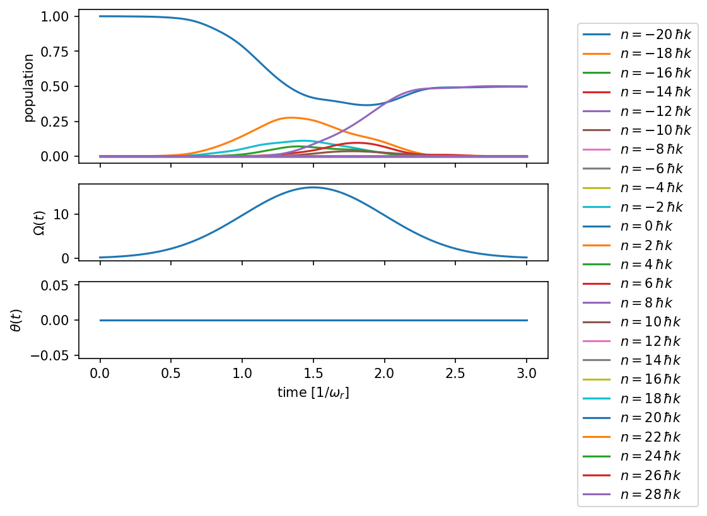
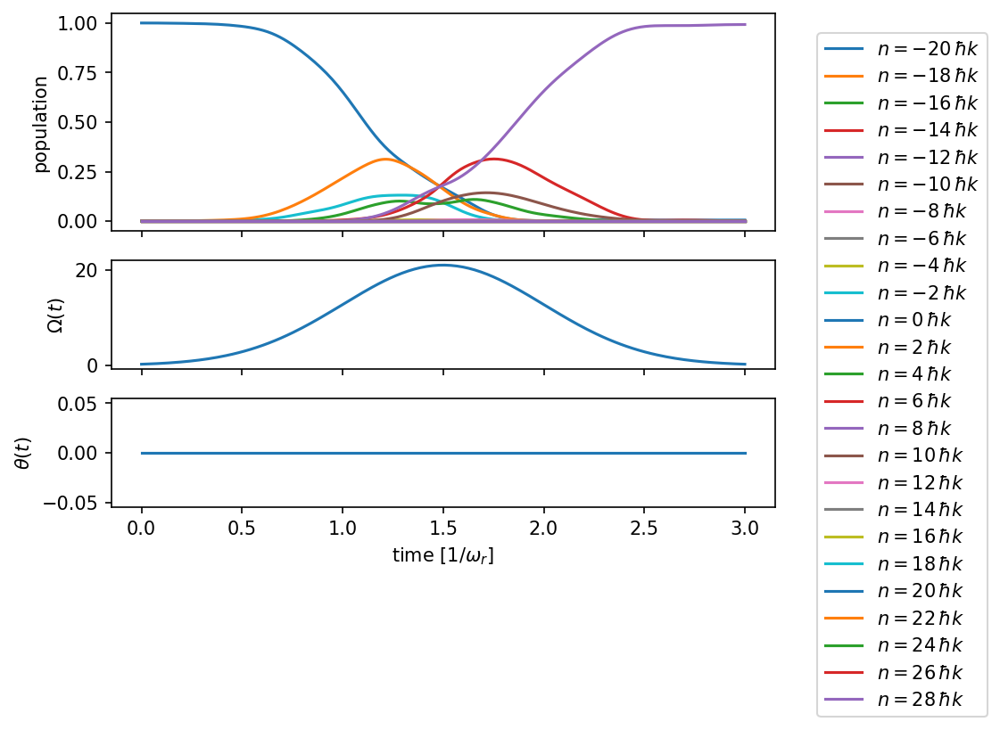
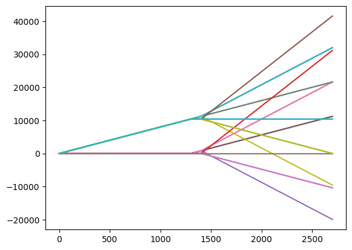
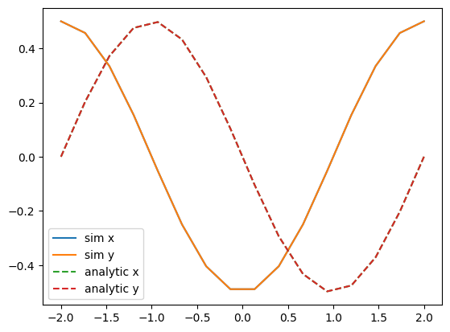
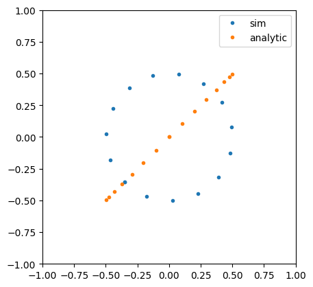

Quickstart
##########

:code:`mwave` is a python library designed to help explore new matterwave interferometer geometries. :code:`mwave` also provides functions to numerically solve the Hamiltonian that describes Bragg diffraction and Bloch oscillations.

Installation
============

Stable releases of :code:`mwave` can be downloaded from `Github`_ or via:

.. _Github: https://github.com/jc-roth/mwave/releases

.. code-block:: bash

   pip install git+https://github.com/jc-roth/mwave@v3.0.0

A first example
===============

Defining an interferometer geometry
-----------------------------------

:code:`mwave` is losely broken up into three parts: a module for symbolically defining arbitrary interferometer geometries, a module for numerically defining arbitrary interferometer geometries, and a module for numerically integrating Bragg and Bloch processes. As an example we will use the library to explore a Mach-Zender interferometer geometry.

First we will import the required libraries

.. code-block:: python

    from mwave import symbolic as msym
    from mwave import integrate as mint
    import numpy as np
    import sympy as sp
    from matplotlib import pyplot as plt

:code:`mwave` internally uses the :code:`sympy` library to build symbolic expressions of
the interferometer phase. Therefore we must define the symbols we want
to use symbolically

.. code-block:: python

    m, c, hbar, k, g, delta, n, T, t_traj = sp.symbols('m c hbar k g delta n T t_traj', real=True)
    k_eff = 2*k

Performing certain operations in mwave requires the user to set certain
constants. In this example we will need to set the mass, speed of light,
the Planck constant, and another variable called :code:`t_traj`.

.. code-block:: python

    msym.set_constants(m=m, c=c, hbar=hbar, t_traj=t_traj)

The unitary operators that we will use to build the interferometer
require these constants. If they are not provided an error will be
thrown. At first glance it makes sense that we need to define constants representing the mass, speed of
light, and the Planck constant in order to define our unitary operators. :code:`mwave` also provides the ability to compute the position of each interferometer path as a function of time, and :code:`t_traj` is used to parameterize this time.

Now we are ready to define unitary operators representing the beamsplitter,
free evolution, and mirror that make up the Mach-Zender interferometer:

.. code-block:: python

    beamsplitter = msym.Beamsplitter(0, n, delta, k_eff, include_half_pi_shift=True)
    mirror = msym.Mirror(0, n, delta, k_eff)
    free = msym.FreeEv(T, gravity=g)

Now that we have defined our unitary operators we can define a new
interferometer object and apply our unitary operators to it.

.. code-block:: python

    ifr = msym.Interferometer()
    ifr.apply(beamsplitter)
    ifr.apply(free)
    ifr.apply(beamsplitter)
    ifr.apply(free)
    ifr.apply(beamsplitter)

Thats it! We have defined the full Mach-Zender interferometer! Note that
unitary operators can also be applied using the matrix multiplication
operator, i.e. ``free @ (beamsplitter @ ifr)``.

Now lets compute the phase of the interferometer. To do this we must
first call the :py:meth:`mwave.symbolic.Interferometer.interfere` method to
check which interferometer paths interfere.

.. code-block:: python

    interfering_paths = ifr.interfere()
    print(f'Found {len(interfering_paths)} interfering paths.')

.. parsed-literal::

    Found 2 interfering paths.

This is expected as a Mach-Zender interferometer has two output ports.

Now that we have computed the interfering paths we can compute the phase
difference between each interfering output:

.. code-block:: python

    phase_differences = ifr.phases()
    for phase_difference in phase_differences:
        print(sp.simplify(phase_difference))

.. parsed-literal::

    2*T**2*g*k*n - pi
    2*T**2*g*k*n

See the `Interferometer Geometries`_ section for more in-depth examples of how to define and analyze interferometer geometries.

.. _`Interferometer Geometries`: examples/geometries.ipynb

Simulating Bragg beamsplitters
------------------------------

Next we can use the :py:func:`mwave.integrate.propagate` function to integrate some initial momentum state through a Bragg diffraction beamsplitter and mirror. We will just eyeball the effective Rabi frequencies for each.

:py:func:`~mwave.integrate.propagate` takes the momentum grid, initial state, final time, two-photon detuning, and callable functions for the Rabi envelope and drive phase. For a Gaussian pulse we use the built-in :py:func:`~mwave.integrate.omega_fnc_gaussian` and :py:func:`~mwave.integrate.phase_fnc_constant`.

.. code-block:: python

    n0, nf = 0, 4
    sigma = 0.5
    omega_bs = 16.1
    omega_mirror = 21
    kvec, n0_idx, nf_idx = mint.make_kvec(n0, nf)

    # Simulate beamsplitter (pi/2 pulse)
    result = mint.propagate(kvec, mint.make_phi(kvec, n0), 6*sigma, 4*(n0+nf),
                            mint.omega_fnc_gaussian, np.array([omega_bs, sigma, 3*sigma]),
                            mint.phase_fnc_constant, np.array([0.0]))
    result.plot()
    plt.show()

    # Simulate mirror (pi pulse)
    result = mint.propagate(kvec, mint.make_phi(kvec, n0), 6*sigma, 4*(n0+nf),
                            mint.omega_fnc_gaussian, np.array([omega_mirror, sigma, 3*sigma]),
                            mint.phase_fnc_constant, np.array([0.0]))
    result.plot()
    plt.show()

The :py:meth:`~mwave.integrate.PropagateResult.plot` method produces a three-panel figure showing the population in each momentum state, the Rabi frequency profile, and the drive phase as a function of time.

The population at any specific momentum state can also be queried with :py:meth:`~mwave.integrate.PropagateResult.population`:

.. code-block:: python

    print(f"Population in n={nf}: {result.population(2*nf):.4f}")

That seems to have worked well enough!

See the `Integrating the Bloch Hamiltonian`_ section for other examples of evolving wavefunctions under the Bloch Hamiltonian.

.. _`Integrating the Bloch Hamiltonian`: examples/bloch_ham_integration.ipynb

Numeric interferometer usage
============================

First we need to import the needed libraries and define our interferometer geometry.

.. code-block:: python

    import numpy as np
    from matplotlib import pyplot as plt
    from tqdm import tqdm

    from mwave.numeric import NumericBraggInterferometer
    from mwave.integrate import propagate, omega_fnc_gaussian, multi_omega_fnc, phase_fnc_constant
    from mwave.utils.cloud import cloud_init
    from mwave.utils.units import recoil

    # Set interferometer parameters
    nbragg = 4
    T = recoil.time(100e-3)
    Tp = recoil.time(8e-3)

    # Initialize kvec and tree
    ifr = NumericBraggInterferometer(-2*nbragg, 4*nbragg, distance=0) # Should pass in wavefunction initialization functions

    # Define interferometer sequence
    ifr.split(nbragg) # Should pass in the relevant function here as well! Function will inspect input function arguments to ensure correct number and naming
    ifr.propagate(T)
    ifr.split(nbragg)
    ifr.propagate(Tp)
    ifr.split([3*nbragg, -nbragg])
    ifr.propagate(T)
    ifr.split([3*nbragg, -nbragg])

    # Get nodes and plot trajectories
    nodes = ifr.get_nodes(x_tolerance=1e-11)
    nA, nB, nC, nD = nodes[4*nbragg], nodes[2*nbragg], nodes[0.0*nbragg], nodes[-2*nbragg]
    Ts = [0, 0, T, T, T + Tp, T + Tp, T + Tp + T, T + Tp + T]

    plt.figure()
    for nn in [nA, nB, nC, nD]:
        for p in nn:
            for node in nn[p]:
                t, x = node.get_trajectory()
                plt.plot(t, x)
    plt.show()

This is our SCI along with all junk ports. To calculate the phase of the interferometer numerically we need a function with signature ``function(*args, k_init, k_final, klattice, t, z)`` to pass to the ``ifr.compile`` function. This function must compute the wavefunction amplitude in state ``k_final`` resulting from a Bragg transition with lattice at ``klattice`` for initial momentum state ``k_init`` at time ``t`` and position ``z``. For now we will ignore the position. The function we write won't be completely general--it will only work for the values of ``klattice`` that we expect. Because of this, we will throw an error if we get an unexpected ``klattice`` value. Finally, we will define a function that acts as an "ideal" beamsplitter, and a function that actually integrates the Bragg dynamics.

.. code-block:: python

    # Define simulation parameters
    Omega0 = 19.5
    tol = 1e-6
    tau_factor = 3
    sigma = recoil.time(20e-6)
    w0 = recoil.length(6.2e-3)

    bs_lookup_dict = {}

    def deltalookup(vz):
        # vz is in recoil velocity units, so it enters delta directly
        return 4*nbragg + 4*vz

    def omegalookup(x, y):
        return Omega0*np.exp(-2*(x**2 + y**2)/(w0**2))

    # Define beamsplitter function
    def prop_bs_wavefunction_ideal(idx, x0, y0, vz, vx, vy, delta_phase_shift, omega_m, k_init, k_final, klattice, t, z):

        # Check if this is a multifrequency beamsplitter
        multifrequency = isinstance(klattice, list)

        # Check that this is a valid lattice
        if not multifrequency:
            assert klattice == nbragg
        else:
            assert len(klattice) == 2
            assert 3*nbragg in klattice
            assert -nbragg in klattice

        # Determine index of k_final state
        kf_idx = np.argmin(np.abs(ifr.kvec - k_final))

        # Determine atom number
        natoms = len(x0)

        # Return analtyic wavefunction amplitude
        if (k_final == 2*nbragg and k_init == 0) or (k_init == 2*nbragg and k_final == 0):
            return 1.0j/np.sqrt(2)*np.exp(1.0j*(-4*nbragg*t + delta_phase_shift)*(k_final - k_init)/2)
        elif (k_final == 4*nbragg and k_init == 2*nbragg) or (k_final == 2*nbragg and k_init == 4*nbragg):
            return 1.0j/np.sqrt(2)*np.exp(1.0j*(-(4*nbragg + omega_m)*t + delta_phase_shift)*(k_final - k_init)/2)
        elif (k_final == -2*nbragg and k_init == 0) or (k_final == 0 and k_init == -2*nbragg):
            return 1.0j/np.sqrt(2)*np.exp(1.0j*(-(4*nbragg - omega_m)*t + delta_phase_shift)*(k_final - k_init)/2)
        elif k_init == k_final:
            return 1.0/np.sqrt(2) + 0.0j
        else:
            return 0.0 + 0.0j

    # Define beamsplitter function
    def prop_bs_wavefunction_bragg(idx, x0, y0, vz, vx, vy, delta_phase_shift, omega_m, k_init, k_final, klattice, t, z):

        # Check if this is a multifrequency beamsplitter
        multifrequency = isinstance(klattice, list)

        # Check that this is a valid lattice
        if not multifrequency:
            assert klattice == nbragg
        else:
            assert len(klattice) == 2
            assert 3*nbragg in klattice
            assert -nbragg in klattice

        # Determine index of k_final state
        k0_idx = np.argmin(np.abs(ifr.kvec - k_init))
        kf_idx = np.argmin(np.abs(ifr.kvec - k_final))

        # Determine atom number
        natoms = len(x0)
        # Load cached result
        if idx in bs_lookup_dict:
            if k_init in bs_lookup_dict[idx]:
                return bs_lookup_dict[idx][k_init][:, kf_idx] if natoms > 1 else bs_lookup_dict[idx][k_init][kf_idx]

        # Compute omegas and deltas
        x = x0 + vx*t
        y = y0 + vy*t
        omegas = omegalookup(x, y)
        deltas = deltalookup(vz)

        # Create phi0
        phi0 = np.zeros_like(ifr.kvec, dtype=np.complex128)
        phi0[k0_idx] = 1.0 + 0.0j

        if natoms > 1:
            phi0 = np.tile(phi0, (natoms, 1))
        else:
            deltas = deltas[0]
            omegas = omegas[0]

        # Integrate
        if not multifrequency:
            result = propagate(
                ifr.kvec, phi0, t + 2*tau_factor*sigma, deltas,
                omega_fnc_gaussian, np.array([1.0, sigma, t + tau_factor*sigma]),
                phase_fnc_constant, np.array([delta_phase_shift]),
                omegas=omegas, t0=t, tol=tol
            )
        else:
            result = propagate(
                ifr.kvec, phi0, t + 2*tau_factor*sigma, deltas,
                multi_omega_fnc, np.array([1.0, sigma, t + tau_factor*sigma, omega_m]),
                phase_fnc_constant, np.array([delta_phase_shift]),
                omegas=omegas, t0=t, tol=tol
            )

        # Save result
        phi = result.phi_final

        # Save wavefunction to cache
        if idx not in bs_lookup_dict:
            bs_lookup_dict[idx] = {}
        if k_init not in bs_lookup_dict[idx]:
            bs_lookup_dict[idx][k_init] = phi
        else:
            raise RuntimeError('Array should not have been created but it was!')

        # Return
        return bs_lookup_dict[idx][k_init][:, kf_idx] if natoms > 1 else bs_lookup_dict[idx][k_init][kf_idx]

Now we will compile the interferometer using the function we have defined above along with the function that describes how phase accumulates during free propagation (this is a trivial function). The ``NumericBraggInterferometer`` class will automatically call the beamsplitter function we have defined at each split, and the propagation function during the propagation steps. We will wrap the compile function in a function called ``sim_ellipse`` that accepts a phase (supposedly coming from vibrations that shift the phase of the third Bragg pulse), and a modulation frequency. It will return the ``x`` and ``y`` location of the ellipse shot for the provided ``vibration_phase`` and ``omega_m``.

.. code-block:: python

    def sim_ellipse(vibration_phase, omega_m, use_ideal=False):

        prop_bs_wavefunction = prop_bs_wavefunction_ideal if use_ideal else prop_bs_wavefunction_bragg

        split_funcs = [
            lambda x0, y0, vz, vx, vy, k_init, k_final, klattice, t, z: prop_bs_wavefunction(0, x0, y0, vz, vx, vy, 0.0, omega_m, k_init, k_final, klattice, t, z),
            lambda x0, y0, vz, vx, vy, k_init, k_final, klattice, t, z: prop_bs_wavefunction(1, x0, y0, vz, vx, vy, 0.0, omega_m, k_init, k_final, klattice, t, z),
            lambda x0, y0, vz, vx, vy, k_init, k_final, klattice, t, z: prop_bs_wavefunction(2, x0, y0, vz, vx, vy, vibration_phase, omega_m, k_init, k_final, klattice, t, z),
            lambda x0, y0, vz, vx, vy, k_init, k_final, klattice, t, z: prop_bs_wavefunction(3, x0, y0, vz, vx, vy, 0.0, omega_m, k_init, k_final, klattice, t, z)
        ]

        propagate_func = lambda x0, y0, vz, vx, vy, t, k: np.exp(-1j*t*k**2)

        kvector_funcs = [
            lambda x0, y0, vz, vx, vy, k_init, k_final, klattice, t, z: 0.0,
            lambda x0, y0, vz, vx, vy, k_init, k_final, klattice, t, z: 0.0,
            lambda x0, y0, vz, vx, vy, k_init, k_final, klattice, t, z: 0.0,
            lambda x0, y0, vz, vx, vy, k_init, k_final, klattice, t, z: 0.0,
        ]

        output_momenta = [4*nbragg, 2*nbragg, 0*nbragg, -2*nbragg]

        popfunc = ifr.compile(split_funcs=split_funcs,
                            propagate_func=propagate_func,
                            output_momentums=output_momenta,
                            kvector_funcs=kvector_funcs,
                            x_tolerance=1e-11)

        def xyfunc(x0, y0, vz, vx, vy):
            pA, pB, pC, pD = popfunc(4*nbragg, [x0, y0, vz, vx, vy]), popfunc(2*nbragg, [x0, y0, vz, vx, vy]), popfunc(0*nbragg, [x0, y0, vz, vx, vy]), popfunc(-2*nbragg, [x0, y0, vz, vx, vy])
            return (pB-pA)/(pB+pA), (pD-pC)/(pD+pC)

        # Cloud parameters supplied in recoil units: lengths in L_r, velocities in v_r
        x0, y0, z0, vz, vx, vy = cloud_init(natoms=1000, sigma_cloud=recoil.length(1e-3), sigma_transverse_v=1.5, sigma_vertical_v=0.1, seed=137)
        x, y = xyfunc(x0, y0, vz, vx, vy)
        x, y = np.mean(x), np.mean(y)

        return x, y

Now, keeping the vibration phase fixed, we will scan the modulation frequency for the ideal beamsplitter case. From Brian Estey's thesis Eq.(2.27) and the unlabeled equation preceeding Eq.(2.27) we also know what phase we expect analytically for both ``x`` and ``y``. We plot these alongside the numerically computed phase.

.. code-block:: python

    # Define analytic form of x and y
    def analytic_ellipse(vibration_phase, omega_m):
        phid = 8*nbragg**2*T - nbragg*omega_m*T
        phic = vibration_phase
        pA = np.cos((phic+phid)/2)**2/8
        pB = np.cos((phic-phid)/2)**2/8
        pC = np.sin((phic-phid)/2)**2/8
        pD = np.sin((phic+phid)/2)**2/8
        return (pB-pA)/(pB+pA)/2, (pD-pC)/(pD+pC)/2

    # Define phases to scan over
    target_phases = np.linspace(-2*np.pi, 2*np.pi, 16)
    omega_ms = 8*nbragg + target_phases/(2*nbragg*T)

    # Loop over each modulation frequency, compute x and y
    x, y = np.full_like(omega_ms, np.nan), np.full_like(omega_ms, np.nan)
    ax, ay = np.full_like(omega_ms, np.nan), np.full_like(omega_ms, np.nan)
    for i in tqdm(range(len(omega_ms))):
        bs_lookup_dict = {} # Reset cache
        x[i], y[i] = sim_ellipse(0.0, omega_ms[i], use_ideal=True)
        ax[i], ay[i] = analytic_ellipse(np.pi/2, omega_ms[i])

    # Plot
    plt.plot(target_phases/np.pi, x, label='sim x')
    plt.plot(target_phases/np.pi, y, label='sim y')
    plt.plot(target_phases/np.pi, ax, '--', label='analytic x')
    plt.plot(target_phases/np.pi, ay, '--', label='analytic y')
    plt.legend()
    plt.show()

The periods agree, but it seems we have a phase offset of :math:`\pi/4` between the two. Not sure why this is.

Moving along to an ellipse

.. code-block:: python

    # Define phases to scan over, select opening phase of pi/2
    omega_m = 8*nbragg - np.pi/2/(2*nbragg*T)
    vibration_phases = np.linspace(0, 2*np.pi/nbragg, 16)

    # Loop over each vibration phase, compute x and y
    x, y = np.full_like(vibration_phases, np.nan), np.full_like(vibration_phases, np.nan)
    ax, ay = np.full_like(omega_ms, np.nan), np.full_like(omega_ms, np.nan)
    for i in tqdm(range(len(vibration_phases))):
        bs_lookup_dict = {}
        x[i], y[i] = sim_ellipse(vibration_phases[i], omega_m, use_ideal=True)
        ax[i], ay[i] = analytic_ellipse(np.pi/2, omega_ms[i])

    plt.plot(x, y, '.', label='sim')
    plt.plot(ax, ay, '.', label='analytic')
    plt.xlim(-1,1)
    plt.ylim(-1,1)
    plt.legend()
    plt.gca().set_aspect('equal')
    plt.show()

